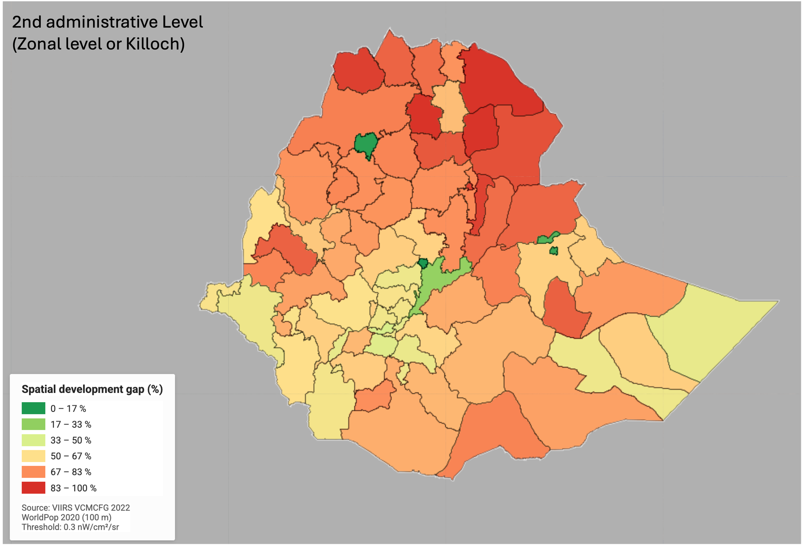
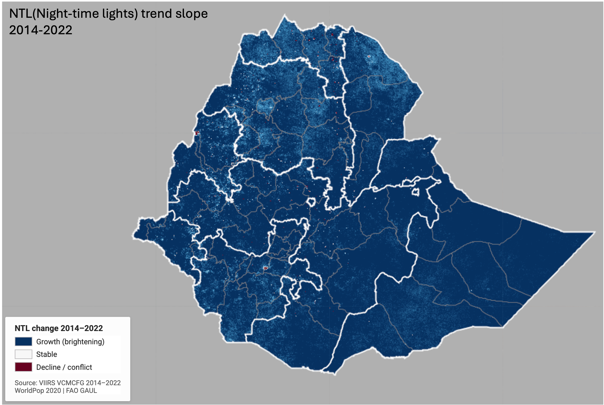
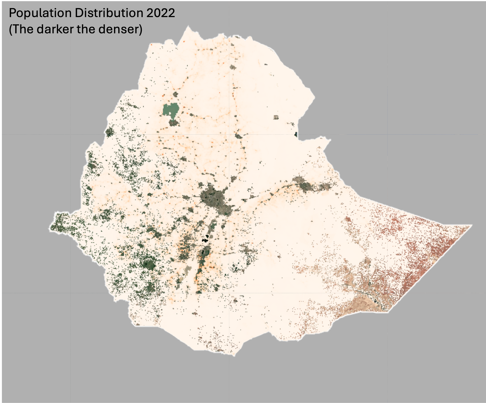
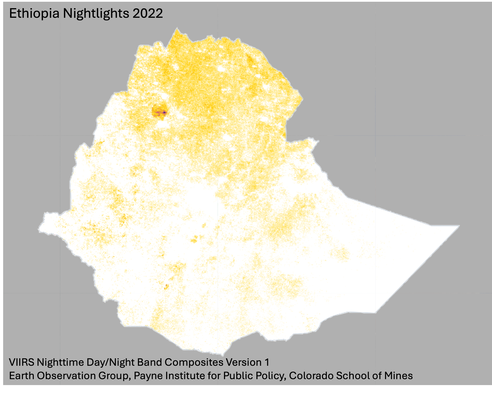
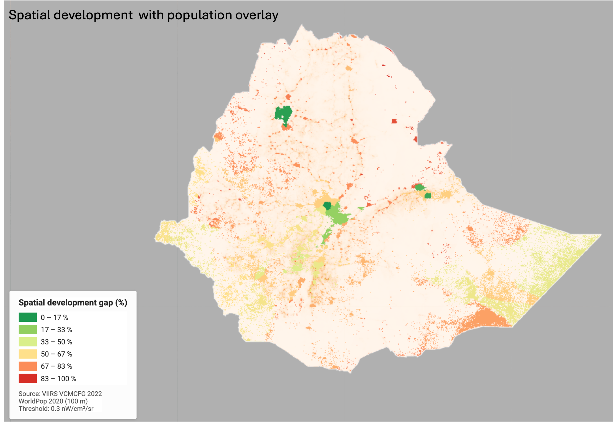
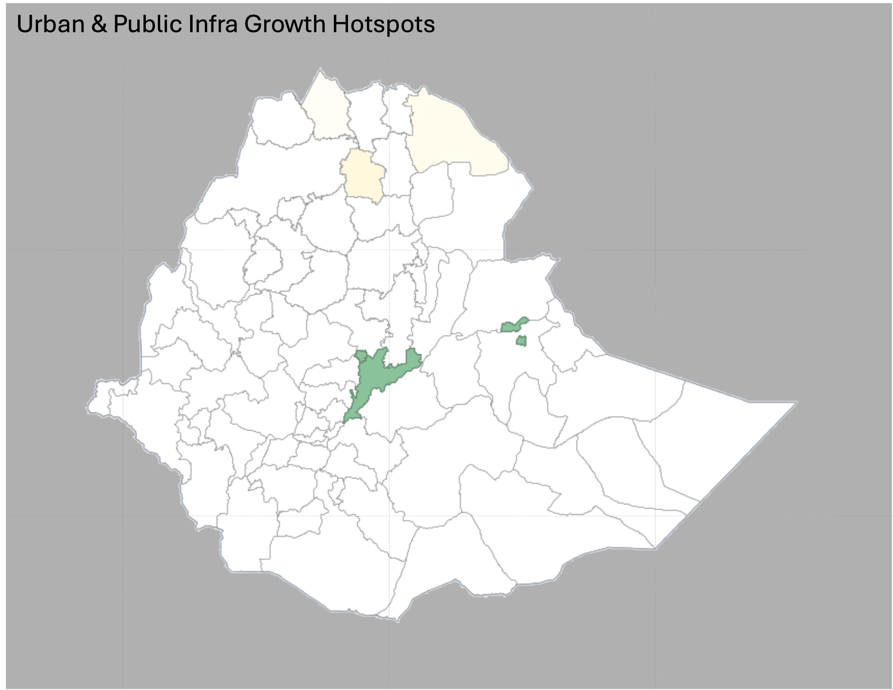
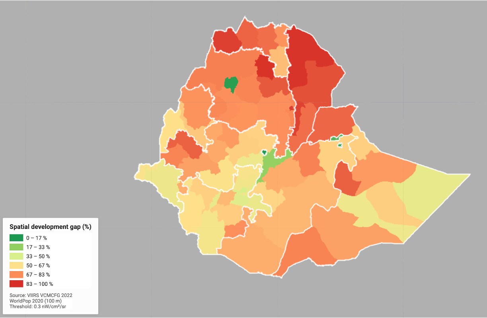

# EThio-Nightlights
### Spatiotemporal Dynamics of Economic Activity in Ethiopia
#### A Satellite Night-time Luminosity Analysis, 2014–2022

---

Night-time light (NTL) radiance captured by the VIIRS satellite sensor serves as a well-established proxy for economic activity, infrastructure density, and urbanisation intensity. This repository presents a zonal-level spatiotemporal analysis of NTL dynamics across Ethiopia, combining VIIRS VCMCFG annual composites (2014–2022) with WorldPop population estimates (2020) to map the spatial distribution of development intensity and its trajectory over eight years.

The analytical framework draws on Henderson, Storeygard & Weil (2012), who demonstrated the robustness of satellite luminosity as an independent measure of economic output, and subsequent applications in sub-Saharan development research (Donaldson & Storeygard, 2016; Falchetta et al., 2019). NTL radiance integrates signals from electricity infrastructure, commercial activity, road lighting, and industrial operations — making it a composite indicator of spatial development rather than a narrow measure of any single infrastructure dimension.
##### scroll down for visualisatins
---

## Repository Structure

```
EThio-Nightlights/
│
├── Images/
│   ├── s_1.png       Spatial development gap — zonal level (2022)
│   ├── s_2.png       NTL trend slope 2014–2022
│   ├── s_3.png       NTL absolute change 2014–2022
│   ├── s_4.png       Population distribution (WorldPop 2020)
│   ├── s_5.png       Ethiopia night-time lights 2022
│   ├── s_6.png       Spatial development with population overlay
│   ├── s_7.png       Urban and public infrastructure growth hotspots
│   └── s_8.png       Spatial development gap — regional level (2022)
│
├── ethiopia_ntl_temporal_v9.js      GEE analysis script (temporal, 2014–2022)
├── ethiopia_electricity_access_gee_v6.js   GEE script (access gap, 2022)
└── README.md
```

---

## Data Sources

| Dataset | Description | Resolution | Source |
|---|---|---|---|
| VIIRS VCMCFG | Cloud-free monthly NTL composites | ~500 m | NOAA / GEE |
| WorldPop | Unconstrained population estimates | 100 m | WorldPop / GEE |
| FAO GAUL 2015 | Administrative boundaries (level 1 & 2) | — | FAO / GEE |

**Why VCMCFG over VCMSLCFG:** The stray-light corrected product (VCMSLCFG) introduces an artificial noise floor of ~0.3–0.5 nW/cm²/sr over equatorial regions, inflating low-radiance values in rural areas and distorting development gap estimates. VCMCFG is the appropriate choice for luminosity-based development analysis in sub-Saharan Africa.

---

## Methodology

**Annual composites** were constructed as cloud-free median composites across all monthly VCMCFG scenes for each study year (2014, 2016, 2018, 2020, 2022). Transient bright sources — fires and gas flares — were masked by removing pixels exceeding 200 nW/cm²/sr.

**Spatial development gap** was derived by computing the proportion of inhabited population (WorldPop > 0 persons per 100m cell) residing in zones with mean NTL radiance below 0.3 nW/cm²/sr. This threshold was selected based on the VCMCFG instrument noise characteristics for the study region and validated against the threshold sensitivity distribution.

**Temporal trend** was estimated per pixel using ordinary least squares linear regression (ee.Reducer.linearFit) across the five annual composites, yielding a slope value (nW/cm²/sr per year) representing the sustained direction and magnitude of luminosity change over the study period.

**Administrative units:** Analysis is conducted at two scales — the 12 regional states (GAUL level 1) and approximately 68–72 zones (GAUL level 2), which are the primary planning and infrastructure allocation units in Ethiopia. All maps are labelled accordingly.

---

## Key Findings

- National mean NTL radiance increased from **0.081 nW/cm²/sr (2014)** to **0.289 nW/cm²/sr (2022)**, representing a **253.5% increase** over eight years, consistent with Ethiopia's documented electrification expansion and industrial park development during this period.
- The spatial development gap varies substantially across zones, with the northeast (Afar, parts of Tigray and Amhara) showing the highest deficit and the Addis Ababa metropolitan corridor the lowest.
- Growth hotspot zones — defined as those with a linear NTL trend slope exceeding 0.040 nW/cm²/sr per year — are concentrated around Addis Ababa and a small number of secondary urban centres, reflecting the spatially uneven distribution of infrastructure investment.
- The population-weighted overlay (s_6) reveals that the zones with the largest unserved populations are not always those with the lowest absolute NTL, highlighting the analytical value of population-weighting over simple luminosity thresholding.

---

## Visualisations

### s_1 — Spatial Development Gap at Zonal Level (2022)


### s_2 — NTL Trend Slope 2014–2022


### s_3 — NTL Absolute Change 2014–2022


### s_4 — Population Distribution (WorldPop 2020)


### s_5 — Ethiopia Night-time Lights 2022


### s_6 — Spatial Development with Population Overlay


### s_7 — Urban and Public Infrastructure Growth Hotspots


### s_8 — Spatial Development Gap at Regional Level (2022)


---

## Limitations

- VIIRS VCMCFG at the national scale has a detection floor of approximately 0.20–0.30 nW/cm²/sr in this region, meaning very low-intensity rural luminosity is compressed near the noise floor. Threshold selection at this boundary is sensitive and should be validated against sub-national survey data (e.g. DHS) where available.
- WorldPop 2020 estimates are used throughout as the population denominator; temporal mismatch with the 2014 NTL baseline is a limitation for early-period population weighting.
- Administrative boundary data (FAO GAUL 2015) predates several restructuring events in southern Ethiopia and may not reflect current zonal boundaries precisely.
- NTL radiance is a composite signal and cannot independently disaggregate electricity access from road lighting, commercial activity, or industrial output. Findings should be interpreted as development intensity rather than infrastructure access in isolation.

---

## Tools and Environment

Analysis conducted entirely in **Google Earth Engine** (Code Editor, JavaScript API). No local compute required. Scripts are self-contained and reproducible with a registered GEE account.

---

## References

- Henderson, J. V., Storeygard, A., & Weil, D. N. (2012). Measuring economic growth from outer space. *American Economic Review*, 102(2), 994–1028.
- Donaldson, D., & Storeygard, A. (2016). The view from above: Applications of satellite data in economics. *Journal of Economic Perspectives*, 30(4), 171–198.
- Falchetta, G., Pachauri, S., Parkinson, S., & Byers, E. (2019). A high-resolution gridded dataset to assess electrification in sub-Saharan Africa. *Scientific Data*, 6, 110.
- Elvidge, C. D., et al. (2017). VIIRS night-time lights. *International Journal of Remote Sensing*, 38(21), 5860–5879.

---

*Data accessed via Google Earth Engine public data catalogue. Administrative boundaries: FAO GAUL 2015. Population: WorldPop Global Project, University of Southampton.*
